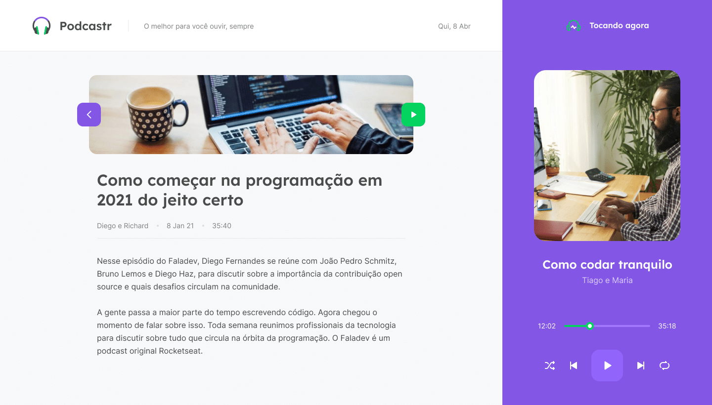

<h1 align="center">
    
</h1>

## nlw5-podcastrnext

Projeto desenvolvido durante a Next Level Week #5 - Trilha Frontend com React e Next.js

Link Protótipo Figma:
https://www.figma.com/file/BCVwta6sH0NA9CxqbYqsc0/Podcastr-(Copy)?node-id=160%3A2761

## Instruções

- Clone o projeto
  `https://github.com/matheuscostadesign/nlw5-podcastrnext.git`

- Instale as dependências:
  `npm install`

- Execute o servidor:
  `npm run server`

- Iniciar ambiente de desenvolvimento:
  `npm run dev`

- Gerar para produção
  `npm run build`

- Executar como produção
  `npm start`
